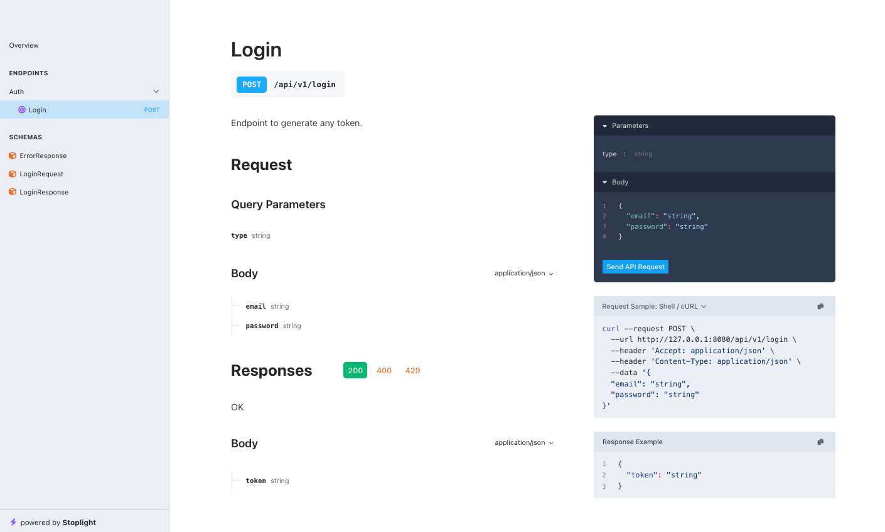

<p>
    
</p>

# exclusive

Generates API documentation for Go [gin](https://github.com/gin-gonic/gin) project. Without requiring you to manually write Swagger annotations. Docs are generated in OpenAPI 3.0.3 json format.


## First

Click star before start. <3

## Introduction

The main motto of the project is generating your API documentation without requiring you to annotate your code.
This allows you to focus on code and avoid annotating every possible param/field as it may result in outdated documentation. By generating docs automatically from the code your API will always have up-to-date docs which you can trust.

## Setup
See [example](https://github.com/elmehdiabdi-src/exclusive/tree/main/example) the main file describe it self.

### Usage
#### Configure
Serve static template to render doc and swagger json setup.

```go
	// ...
	
	engine := gin.Default()
	
	// Serve swagger template.
	engine.StaticFile("/docs", "./public/index.html")
	
	// add
	engine.GET("/swagger.json", func(c *gin.Context) {
	
		schema := exclusive.Swag(engine, c, &exclusive.Configure{
			Responses: map[int]any{
				429: &ErrorResponse{},
				400: &ErrorResponse{},
			},
		})
	
		c.String(http.StatusOK, schema)
	
	})
	
	// ...

```

#### Describe your routes
As you can see its like magic and feel safe.


```go
	// ...
	v1 := engine.Group("api/v1")
	
	{
		v1.POST("/login", func(c *gin.Context) {
		
			type LoginRequest struct {
				Type     string `query:"type" binding:"required"`
				Email    string `json:"email" binding:"required"`
				Password string `json:"password" binding:"required"`
			}
		
			type LoginResponse struct {
				Token string `json:"token"`
			}
		
			c.Set("doc", exclusive.Doc{
				IsDeprecated: false,
				Tags:         "Auth",
				ID:           "Login",
				Request:      new(LoginRequest),
				Response:     new(LoginResponse),
				Description:  "Endpoint to generate any token.",
			})

			// YOUR LOGIC GOES HERE :)
		
		})
	}
	// ...

```


## Contributing

- With issues:
  - Use the search tool before opening a new issue.
  - Please provide source code and commit sha if you found a bug.
  - Review existing issues and provide feedback or react to them.

- With pull requests:
  - Open your pull request against `master`
  - Your pull request should have no more than two commits, if not you should squash them.
